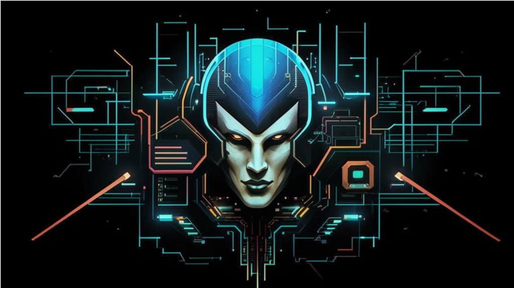

### This image generated with [Kandinsky](https://fusionbrain.ai/)

## It's not ready yet

### Build Dependencies

- [fd](https://github.com/sharkdp/fd)
- [jq](https://stedolan.github.io/jq/)
- [just](https://github.com/casey/just)
- [sd](https://github.com/chmln/sd)
- [dart protoc_plugin](https://pub.dev/packages/protoc_plugin)
- [rust](https://www.rust-lang.org/)
- [flatbuffers](https://flatbuffers.dev/)

## Build Process
The code generation process just in 1 step;
1. `just protos` - download k8s `.proto` and generate it to dart and rust files;

## On Windows
1. Install Clang compiler with Visual Studio Installer;
2. Install openssl using command  `vcpkg install openssl:x64-windows-static`;
3. Set `OPENSSL_DIR` env to your system (by default vcpkg install packages to folder `C:\PATH\vcpkg\packages`);